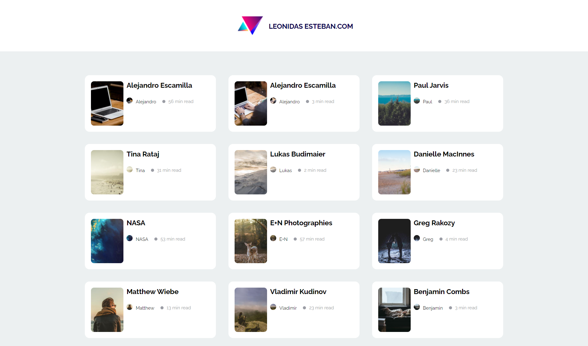
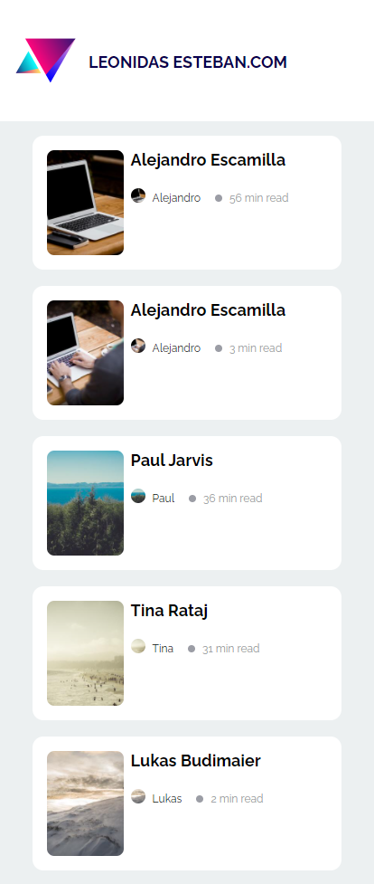

# Proyecto: Skeleton :black_circle: 
Se usa la API de Lorem [Picsum](https://picsum.photos/), para mostrar imagenes y detalles de esto, previamente haciendo un skeleton, de una vista previa del contenido a mostrar segundos despues.

### Demo :tv:

Has click en el enlace para ver el  **[resultado](https://cesarchoqueskater.github.io/skeleton-project/)** 

## Desktop :computer:

## Mobile :camera:

---

# Skeleton
Cubre unos de los escenarios esenciales en una interfaz, aplicando una genial transición entre elementos sin contenido y después pintando toda la información necesaria.

## Requerimentos

Estilo libre. Lleva el diseño al código utilizando tu framework favorito, o con HTML y CSS, no hay ninguna limitación.

- Aplicar una animación opcional para generar un efecto de transición
- Cubre todas las resoluciones del diseño
- Sube tu código a GitHub
- Publica tu resultado con github pages
- Mándalo a revisión desde tu [perfil](https://leonidasesteban.com/estudiante)

## Disclaimer

Todas son propuestas, el propósito de **/Proyectos** es brindarte el diseño, el límite de la creación lo dictan tus ganas de hacerlo realidad y tu skills del momento a la hora de codear.

## Revisión

Recuerda mandar tu proyecto a revisión, si aún no conoces como funciona el proceso de revisión lee este post: [Como usar proyectos en 3 pasos](https://leonidasesteban.com/blog/como-usar-proyectos-en-3-pasos)

## Créditos

Encuentra más proyectos asombrosos en [/Proyectos](https://leonidasesteban.com/proyectos)

Diseñado con ♥️ en leonidasesteban.com
